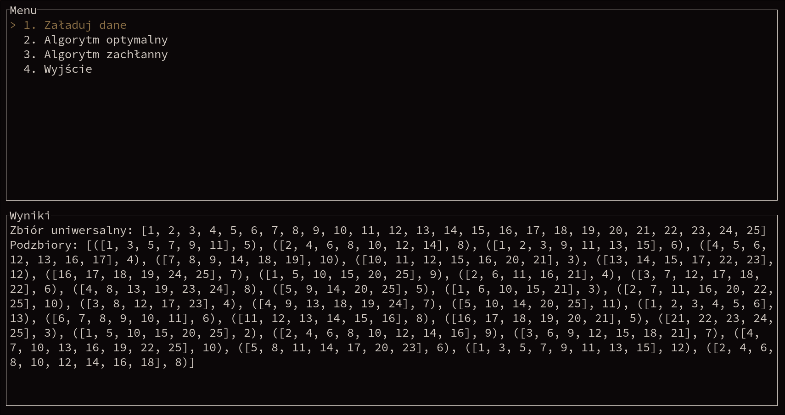
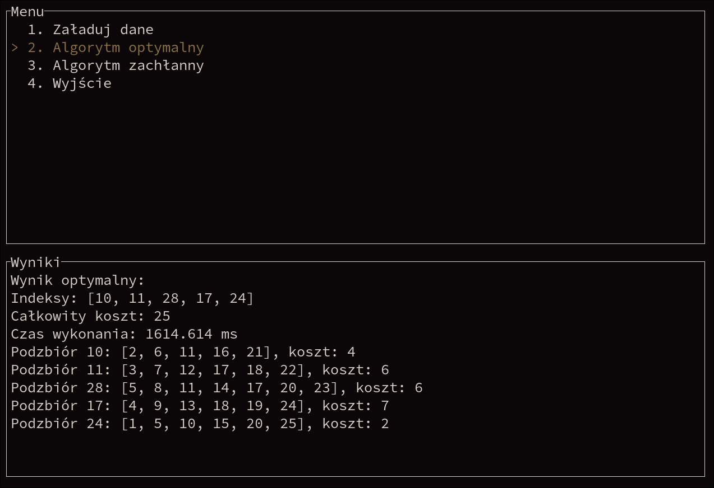

# Set Cover Solver TUI in Rust

A terminal-based application written in **Rust** for solving the **weighted set cover problem** using both a **greedy heuristic** and an **exact algorithm**.

This project is meant to showcase:
- algorithm design,
- combinatorial optimization,
- file parsing and input validation,
- terminal UI development in Rust.

## Features

- terminal user interface,
- loading problem instances from text files,
- greedy algorithm for fast approximate solutions,
- exact algorithm for optimal solutions,
- execution time measurement,
- result presentation directly in the TUI.

## Tech stack

- Rust
- Cargo
- ratatui
- crossterm

## Input format

The first line defines the universe:

```text
[1 2 3 4 5]
```

Each next line defines a subset and its cost:

```text
[[1 2] 3]
[[2 3 4] 4]
[[4 5] 2]
```

Meaning:
- `[1 2 3 4 5]` is the universe,
- `[[1 2] 3]` means subset `{1, 2}` with cost `3`.

Ready-to-use example instances are available in the `examples/` directory.

## Screenshots




## Download and run

Download the latest release archive for Linux x86_64 from the GitHub Releases page.

Extract it:

```bash
tar -xzf set-cover-bin-v0.1.0-linux-x86_64.tar.gz
cd set-cover-bin-v0.1.0
./set-cover-bin
```

## License

MIT
